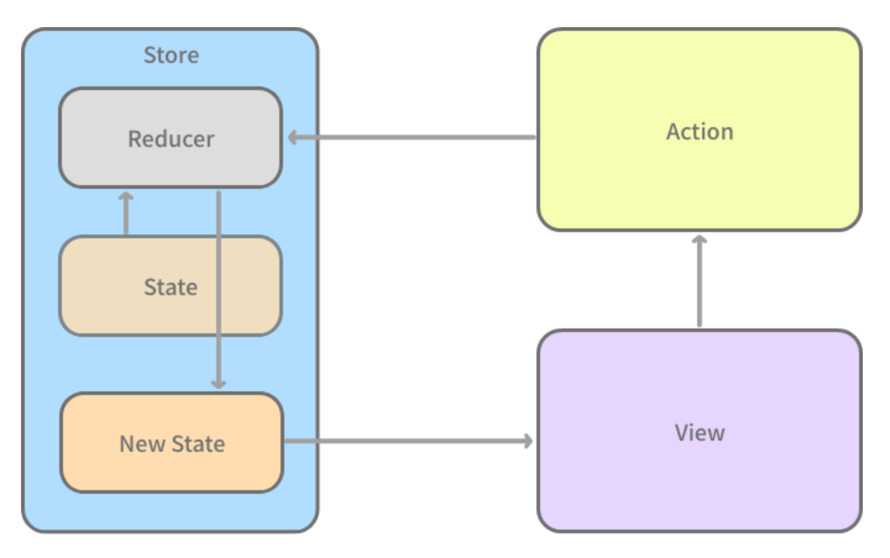

# DriverHub
车行家（DriverHub）是一个 watchOS App 项目，使用 Swift + SwiftUI + Combine 技术开发，包含注册/登录，车辆信息和登录用户信息展示等功能。

## 项目架构
开发这个 App 时，SwiftUI 还在早期阶段，该项目运用了一种类似于 Redux，但是针对 SwiftUI 的特点进行了一些改变的数据管理方式：

这套数据流动方式的特点：

1. 整个 App 是一个状态机，状态决定用户界面，所有 State 都保存在一个 Store 对象中。
1. View 不能直接操作 State，只能通过发送 Action 或 Binding 的方式改变存储在 Store 中的 State。
1. Reducer 接受原有的 State 和发送过来的 Action，生成新的 State，再额外返回一个用来执行副作用的 Command 值。
1. 用新的 State 替换 Store 中原有的状态，并用新状态来驱动用户界面更新。

## 参考书籍

[SwiftUI 与 Combine 编程](https://objccn.io/products/swift-ui)

